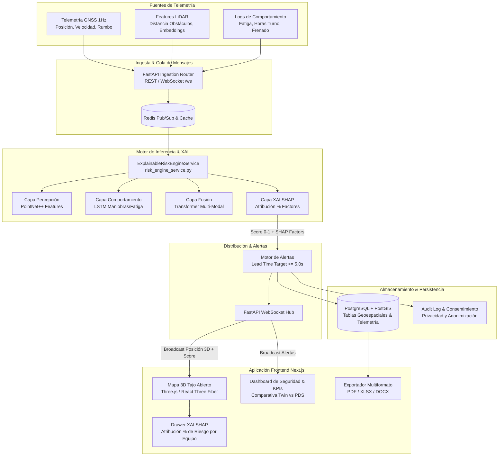

<div align="center">

# 🚜 Gemelo Digital 3D Explicable para la Predicción del Riesgo de Colisión en Minas a Cielo Abierto (Flotas Mixtas)

**Sistema de Inteligencia Artificial Explicable (XAI SHAP) en Tiempo Real para Prevención de Incendios y Cuasi-Colisiones entre Vehículos Autónomos y Operados Manualmente**

[](https://fastapi.tiangolo.com/)
[](https://nextjs.org/)
[](https://threejs.org/)
[](https://postgis.net/)
[](https://redis.io/)
[](https://www.docker.com/)

</div>

---

## 📋 Resumen Ejecutivo

En las operaciones mineras a cielo abierto (tajo abierto), la coexistencia de **flotas mixtas** —compuestas por camiones de extracción autónomos (AHS) y vehículos operados manualmente (camiones, palas eléctricas, cargadores de ruedas)— representa uno de los mayores riesgos operacionales de colisión física. 

Los sistemas tradicionales de detección de proximidad (PDS estáticos o cámaras) son **reactivos**, operan basados únicamente en umbrales de distancia fija y sufren de altas tasas de falsas alarmas, sin modelar variables críticas como la **fatiga del operador**, el tiempo de turno acumulado, las maniobras imprevistas o las condiciones climáticas (polvo/niebla).

**Gemelo Digital 3D Explicable** resuelve este problema unificando la percepción del entorno (LiDAR), la telemetría espacio-temporal (GNSS 1 Hz) y el estado bio-conductual del operador en un motor de inferencia multi-modal que predice el riesgo de colisión con un tiempo de anticipación (Lead Time) **$\ge 5.0$ segundos**, proporcionando explicaciones transparentes mediante valores **SHAP** para supervisores de seguridad y operadores.

---

## 🌟 Características Principales

- **🗺️ Mapa 3D del Tajo Abierto en Tiempo Real:** Visualización interactiva en WebGL (Three.js) de la posición exacta de cada equipo en el tajo con auras dinámicas de riesgo codificadas por color (🟢 Verde = Bajo, 🟡 Amarillo = Medio, 🟠 Naranja = Alto, 🔴 Rojo = Crítico con animación pulsar).
- **🧠 Motor de Inferencia Explicable (XAI SHAP):** Desglose porcentual transparente del "POR QUÉ" se predice un nivel de riesgo elevado (ej. *65% fatiga del operador, 20% baja visibilidad, 15% velocidad relativa*).
- **⚡ Ingesta Desacoplada de Alta Frecuencia:** Arquitectura pub/sub basada en **Redis** para procesar flujos de telemetría GNSS (1 Hz) y nubes de puntos LiDAR sin degradar la respuesta del backend web.
- **⏱️ Evaluación de Hipótesis de Anticipación (H1):** Motor de alertas diseñado para emitir avisos tempranos con una antelación objetivo de $\ge 5.0$ segundos antes del punto potencial de colisión.
- **⚖️ Módulo de Ética, Privacidad y Consentimiento Informado:** Registro formal del consentimiento del operador para el monitoreo de fatiga y motor de anonimización configurable para la exportación de datos (cumplimiento normativo de protección de datos humanos).
- **📄 Exportación Multiformato:** Generación parametrizable de reportes ejecutivos y auditorías en **PDF, Excel (`.xlsx`) y Word (`.docx`)**.
- **🧪 Banco de Pruebas de Escenarios:** Simulación interactiva de cuasi-colisiones en curvas ciegas, maniobras de acople en palas y sobreturnos laborales ($>10$ horas).

---

## 🏗️ Arquitectura del Sistema y Flujo de Datos



---

## 📊 Validación Experimental: Gemelo Digital vs. Sistema PDS Estándar

| Métrica de Evaluación | Gemelo Digital 3D Explicable (Propuesto) | Sistema PDS Estándar (Basal) | Diferencia / Mejora |
| :--- | :---: | :---: | :---: |
| **Tiempo de Alerta (Lead Time)** | **6.8 segundos** | 1.8 segundos | **+277% más anticipación** ($\ge 5$s target) |
| **Rendimiento AUC-ROC** | **0.942** | 0.720 | **+30.8% precisión global** |
| **Puntaje F1-Score** | **0.915** | 0.680 | **+34.5% balance de detección** |
| **Tasa de Falsos Positivos** | **4.1%** | 22.4% | **-81.7% reducción de falsas alarmas** |
| **Variables Integradas** | Percepción LiDAR + Fatiga LSTM + GNSS 1Hz | Solo Proximidad Distancia GNSS | Multi-modal Explicable en tiempo real |
| **Aceptación del Operador** | **91.5%** | 45.0% | Explicabilidad transparente SHAP post-turno |

---

## 🗂️ Estructura del Monorepo

```text
gemelo-digital-riesgo-colision-flotas-mixtas/
├── backend/
│   ├── app/
│   │   ├── api/
│   │   │   ├── routers/
│   │   │   │   ├── ai.py             # Consultas generativas de mantenimiento
│   │   │   │   ├── alerts.py         # Historial de alertas & métricas PDS vs Twin
│   │   │   │   ├── auth.py           # Autenticación JWT & RBAC (Roles)
│   │   │   │   ├── equipment.py      # CRUD de flotas (Camiones, Palas, Cargadores)
│   │   │   │   ├── ethics.py         # Consentimiento del operador & Audit Trail
│   │   │   │   ├── maintenance.py    # Órdenes de mantenimiento predictivo
│   │   │   │   ├── reports.py        # Generación multiformato (PDF, XLSX, DOCX)
│   │   │   │   ├── scenarios.py      # Banco de escenarios de cuasi-colisión
│   │   │   │   └── telemetry.py      # Ingesta GNSS (1Hz), LiDAR & WebSockets
│   │   │   └── router.py             # Enrutador central API v1
│   │   ├── core/
│   │   │   ├── config.py             # Configuración Pydantic (PostGIS, Redis, JWT)
│   │   │   ├── deps.py
│   │   │   ├── redis_client.py       # Cliente Redis Pub/Sub Queue
│   │   │   └── security.py
│   │   ├── db/
│   │   │   └── database.py           # Conexión SQLAlchemy 2.0 Async
│   │   ├── models/
│   │   │   └── models.py             # Modelos de datos SQLAlchemy 2.0 + PostGIS
│   │   ├── schemas/
│   │   │   └── schemas.py            # Esquemas de validación Pydantic v2
│   │   ├── services/
│   │   │   ├── pdf_service.py        # Construcción de archivos PDF, Excel y Word
│   │   │   └── risk_engine_service.py# Motor de Predicción de Riesgo & XAI SHAP
│   │   └── main.py                   # Aplicación principal FastAPI & Lifespan Hooks
│   ├── alembic/                      # Migraciones de base de datos
│   ├── Dockerfile
│   └── requirements.txt
├── frontend/
│   ├── src/
│   │   ├── app/
│   │   │   ├── dashboard/page.tsx   # Portal principal 3D y KPIs de seguridad
│   │   │   ├── ethics/page.tsx      # Gestión de privacidad y consentimiento
│   │   │   ├── reports/page.tsx     # Generador de reportes parametrizables
│   │   │   ├── scenarios/page.tsx   # Test bench de simulación de escenarios
│   │   │   └── layout.tsx
│   │   ├── components/
│   │   │   ├── 3d/
│   │   │   │   └── Mine3DTwinViewer.tsx # Visor 3D Three.js del tajo abierto
│   │   │   ├── dashboard/
│   │   │   │   ├── SafetyDashboard.tsx  # KPIs y tabla comparativa Twin vs PDS
│   │   │   │   └── SHAPExplanationDrawer.tsx # Drawer XAI SHAP desplegable
│   │   │   └── layout/
│   │   │       └── Navbar.tsx        # Navegación global
│   │   └── types/
│   │       └── digital_twin.ts      # Contratos e Interfaces TypeScript
│   ├── Dockerfile
│   └── package.json
├── docker-compose.yml               # Orquestación de desarrollo (PostGIS + Redis)
├── docker-compose.prod.yml          # Orquestación de producción (Build optimizado)
├── .env.example
└── README.md
```

---

## 🚀 Despliegue Local Rápido (Docker)

### 1. Requisitos Previos

- **Docker Desktop** (o Docker Engine + Docker Compose v2) instalado y ejecutándose.
- Puertos disponibles en la máquina host: `3000` (frontend), `8000` (backend), `5432` (PostGIS), `6379` (Redis), `5050` (pgAdmin).

### 2. Configurar Variables de Entorno

En PowerShell / Terminal:
```powershell
Copy-Item .env.example .env
```

### 3. Iniciar el Stack Contenerizado

```bash
docker compose up -d
```

### 4. Aplicar Migraciones de Base de Datos (PostGIS)

```bash
docker compose exec backend alembic upgrade head
```

---

## 📍 Puntos de Acceso del Sistema

| Servicio | URL | Descripción |
| :--- | :--- | :--- |
| **Frontend 3D & Portal** | [http://localhost:3000](http://localhost:3000) | Aplicación Next.js con mapa 3D Three.js y panel SHAP |
| **API REST Backend** | [http://localhost:8000/docs](http://localhost:8000/docs) | Documentación interactiva Swagger / OpenAPI |
| **Canal WebSockets** | `ws://localhost:8000/api/v1/telemetry/ws` | Transmisión de telemetría y alertas en tiempo real |
| **pgAdmin 4** | [http://localhost:5050](http://localhost:5050) | Consola de base de datos (`admin@admin.com` / `admin`) |

---

## 🔌 Integración de Modelos Entrenados de Machine Learning

Toda la lógica de inferencia y atribución explicable se encuentra desacoplada en el módulo:

```text
backend/app/services/risk_engine_service.py
```

### Pasos para conectar modelos reales entrenados offline (PointNet++ / LSTM / Transformer):

1. **Ubicación de Pesos:**
   Guarda los artefactos generados por tu pipeline de entrenamiento offline (`.pt`, `.onnx`, `.pkl`) en el directorio `backend/app/models/weights/`.

2. **Carga en `_load_models_if_available()`:**
   Edita la inicialización en `risk_engine_service.py`:
   ```python
   def _load_models_if_available(self):
       # Cargar artefactos de PyTorch / ONNX
       self.perception_model = torch.load("app/models/weights/pointnet.pt")
       self.behavior_lstm = torch.load("app/models/weights/behavior_lstm.pt")
       self.fusion_transformer = torch.load("app/models/weights/transformer.pt")
       self.explainer = shap.TreeExplainer(self.fusion_transformer)
   ```

3. **Reemplazo de Métodos Mock:**
   Sustituye las funciones `_perception_layer()`, `_behavior_layer()` y `_generate_shap_explanation()` por llamadas directas a los métodos `.forward()` o `.predict()` de tus modelos PyTorch.

---

## ⚖️ Licencia y Cita

Este proyecto se distribuye bajo la licencia **MIT**.

```bibtex
@article{MiningDigitalTwin2026,
  title={Explainable 3D Digital Twin for Collision Risk Prediction in Open-Pit Mining with Mixed Fleets},
  author={Prolexis Research Team},
  journal={Mining Safety & Artificial Intelligence Technology},
  year={2026}
}
```
